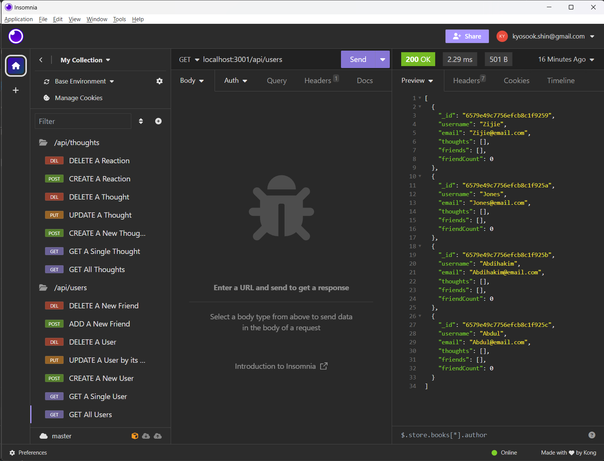
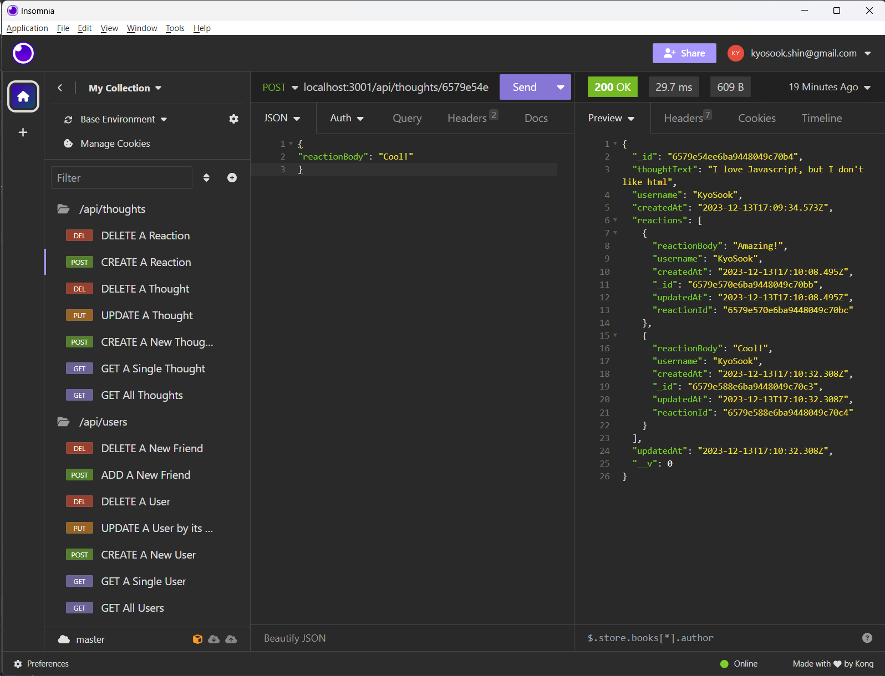

# social_net_API  

## Description

AS A social media startup, I WANT an API for my social network that uses a NoSQL database 
SO THAT my website can handle large amounts of unstructured data.

## Features

GIVEN a social network API.

* WHEN you enter the command to invoke the application, THEN your server is started and the Mongoose models are synced to the MongoDB database 

* WHEN you open API GET routes in Insomnia for users and thoughts, THEN the data for each of these routes is displayed in a formatted JSON

* WHEN you test API POST, PUT, and DELETE routes in Insomnia, THEN you are able to successfully create, update, and delete users and thoughts in your database

* WHEN you you test API POST and DELETE routes in Insomnia, THEN you are able to successfully create and delete reactions to thoughts and add and remove friends to a user's friend list.

## Rest API Routes
* This application provides Rest APIs for a social network web application

1. /api/users
  * `GET` all users
  * `GET` a single user by its `_id` and populated thought and friend data
  * `POST` a new user
  * `PUT` to update a user by its `_id`
  * `DELETE` to remove user by its `_id` and to remove a user's associated thoughts

2. /api/users/:userId/friends/:friendId
  * `POST` to add a new friend to a user's friend list
  * `DELETE` to remove a friend from a user's friend list  

3. /api/thoughts
  * `GET` to get all thoughts
  * `GET` to get a single thought by its `_id`
  * `POST` to create a new thought and to push the created thought's `_id` to the associated user's `thoughts` array field
  * `PUT` to update a thought by its `_id`
  * `DELETE` to remove a thought by its `_id`  

4. /api/thoughts/:thoughtId/reactions
  * `POST` to create a reaction stored in a single thought's `reactions` array field
  * `DELETE` to pull and remove a reaction by the reaction's `reactionId` value

## Walkthrough Video
https://drive.google.com/file/d/1VI9CdqmGv33BuaDoVtsrAnrLlC8j0_bi/view

## Installation on your local machine
* After downloading from GitHub, you can run this program on your local machine by following the procedure below:
1. Run `npm run seed` to seed data. Seed data create 5 users and 1 thought. 
2. Run `nodemon index.js` to run backend server on your local machine.
3. From Insomnia, send Restful API queries.

## Source Code References
  This project has used some reference codes from the following sites

   * https://git.bootcampcontent.com/University-of-Texas-at-Austin/UTA-VIRT-FSF-PT-07-2023-U-LOLC.git   

## Contact
  * Author: Kyosook Shin
  * Author's Email: kyosook.shin@gmail.com  
  * GitHub: https://github.com/alla0810/social_net_API

## Screenshot  

  

